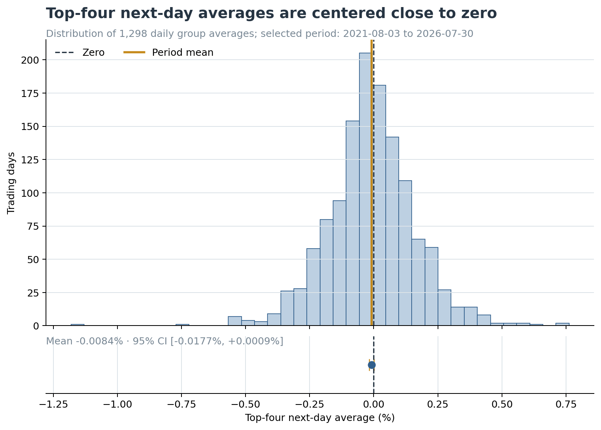
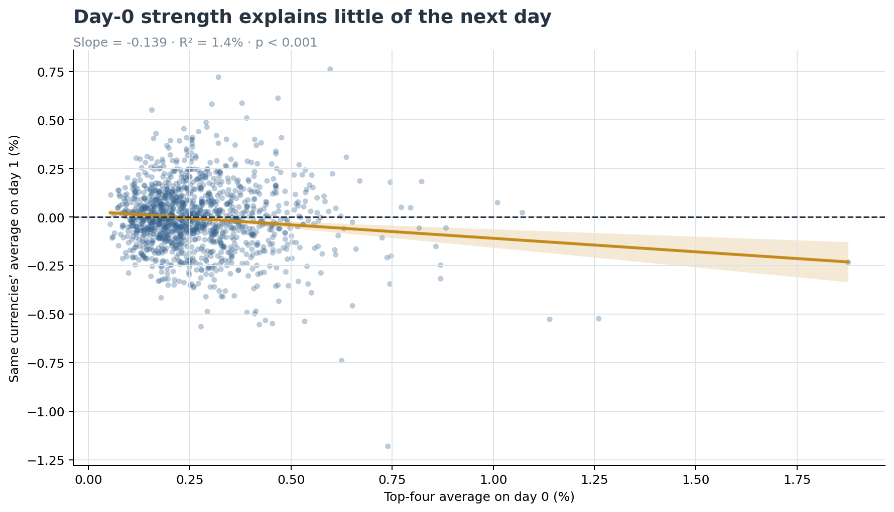

# Do Today’s Strongest Currencies Stay Strong Tomorrow?

An exploratory FX case study testing whether the four strongest major currencies on one trading day continue to outperform on the next.

| Period | Daily group observations | Mean next-day average | 95% confidence interval | Regression R² |
|---|---:|---:|---:|---:|
| Aug 2021–Jul 2026 | 1,298 | −0.0084% | [−0.0177%, +0.0009%] | 1.4% |

## Purpose

Turn relative FX-pair movements into a simple currency ranking and test whether that ranking contains a useful one-day signal.

## Problem

Currencies trade in pairs, so no currency has a standalone return. This project combines each currency’s signed return contribution across the seven pairs in which it appears, producing one daily strength score for each of:

`EUR · USD · JPY · GBP · CHF · AUD · CAD · NZD`

## Hypothesis

- **Momentum:** the four strongest currencies on day 0 remain positive on day 1.
- **Mean reversion:** the same currencies turn negative on day 1.
- **Null:** their average next-day result is zero and day‑0 strength does not meaningfully explain day‑1 strength.

## Analysis

1. Calculate daily percentage changes for all 28 unique currency pairs.
2. Convert pair returns into eight equal-weighted currency-strength scores.
3. Select the four strongest currencies each day.
4. Measure those same four currencies on the following trading day.
5. Evaluate `top4_next_day_avg` across the full period and regress day‑1 results on day‑0 strength.

Because all eight strength scores sum to zero, the bottom-four result is the mirror of the top-four result. Keeping both would be redundant.

## Results

### The period average is close to zero



The daily group averages vary widely around zero. Their full-period mean is **−0.0084%**, and the 95% bootstrap confidence interval includes zero. The sample therefore does not show a reliable positive continuation effect.

### Day-0 strength has little explanatory power



The fitted slope is negative (**−0.139**), suggesting weak one-day mean reversion. However, the model explains only **1.4%** of next-day variation. That is too little to treat the ranking as a useful standalone forecast.

## Finding

The original momentum hypothesis is not supported. The strongest currencies did not reliably remain strong the next day. The data show a small reversal relationship, but most next-day movement remains unexplained.

This is an exploratory strength-index result—not evidence of a profitable trading strategy.

## Reproduce

```bash
python -m pip install -r requirements.txt
python scripts/build_case_study.py
jupyter nbconvert --execute --to notebook --inplace fx_currency_strength_case_study.ipynb
```

The repository includes the frozen Yahoo Finance input in `data/` so the analysis is reproducible without downloading new market data.
